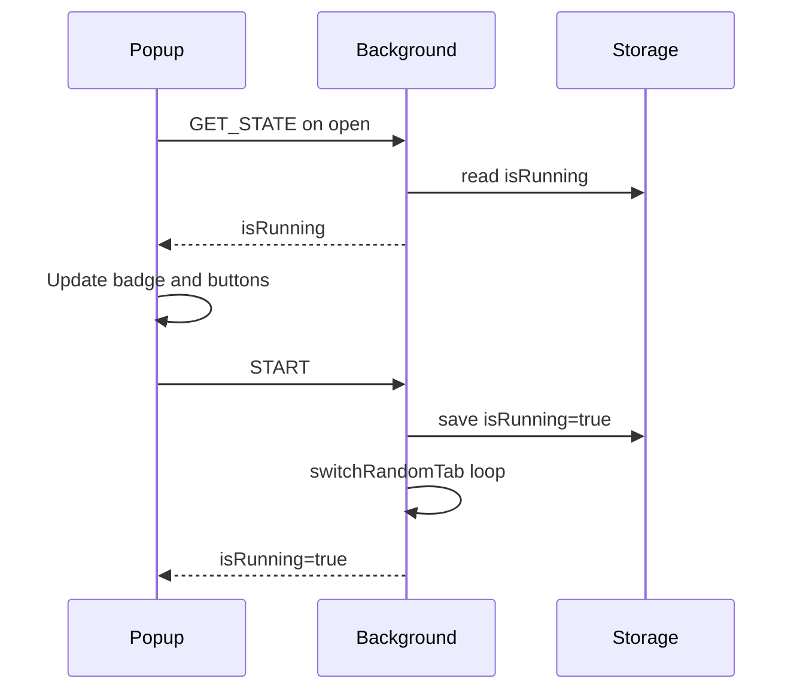

# Random Tab Switcher

A Chrome extension that automatically switches between open tabs in the current window at random intervals. Useful for keeping browser sessions active without manual interaction.

## Features

- **Random tab switching** — Picks a random tab in the current window every 3–10 seconds
- **Simple controls** — Start and Stop buttons with clear enabled/disabled states
- **Live status UI** — Running/Stopped badge, status dot, and subtitle update in real time
- **Persistent state** — Remembers whether switching is active across popup closes and extension reloads
- **Polished popup** — Light theme with orange/pink branding that matches the extension icon

## Installation

1. Clone or download this repository
2. Open Chrome and go to `chrome://extensions`
3. Enable **Developer mode** (top-right toggle)
4. Click **Load unpacked**
5. Select the `RandomTabSwitcher` folder

The extension icon appears in the Chrome toolbar. Click it to open the popup.

## Usage

1. Open the extension popup from the toolbar
2. Click **Start** to begin random tab switching
3. The status badge changes to **Running** and the Start button is disabled
4. Click **Stop** at any time to end switching
5. Close and reopen the popup — the current state is preserved

Switching only affects tabs in the **current window**. If only one tab is open, the extension waits and retries on the next interval.

## Project structure

```
RandomTabSwitcher/
├── manifest.json    # Extension config (Manifest V3)
├── background.js    # Service worker — tab switching logic and state persistence
├── popup.html       # Popup markup
├── popup.css        # Popup styles
├── popup.js         # Popup UI and Start/Stop handling
├── icon.png         # Extension icon (toolbar + popup header)
└── README.md
```


## How it works



The background service worker:

1. Queries all tabs in the current window
2. Activates a random tab
3. Schedules the next switch after a random delay (3–10 seconds)
4. Saves running state to `chrome.storage.local` so it survives service worker restarts

## Permissions

| Permission | Purpose |
|------------|---------|
| `tabs` | Read and activate tabs in the current window |
| `storage` | Persist running/stopped state |

## Development

No build step is required. After editing files:

1. Go to `chrome://extensions`
2. Click the refresh icon on the Random Tab Switcher card
3. Reopen the popup to test changes

## License

MIT
